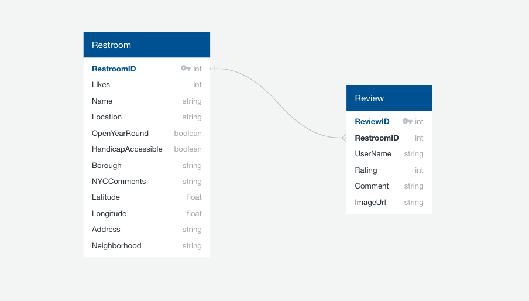

# NYC Toilet Locator

An app for NYC residents and tourists to search for and review NYC public restrooms by user location, borough, and neighborhood filters.

- Developed a postgreSQL database utilizing custom pagination of toilet data and user reviews.
- Harnessed the NYC Open Data API to pull and geocode data on restrooms in public parks.
- Leveraged HTML5 Geolocation API to filter public restrooms results based on the users device location.

### Ruby on Rails Backend - [Link](https://github.com/bryanmoon1991/nyc-toilet-locator-backend)

### Javascript Frontend - [Link](https://github.com/bryanmoon1991/nyc-toilet-locator-frontend)

### Seed Data

- [NYC Toilets in Public Parks API](https://data.cityofnewyork.us/Recreation/Directory-Of-Toilets-In-Public-Parks/hjae-yuav)

### Packages

- [Active Model Serializers](https://github.com/rails-api/active_model_serializers)
- [geocoder](http://www.rubygeocoder.com/)
- [will_paginate](https://github.com/mislav/will_paginate)
- [pg_search](https://github.com/Casecommons/pg_search)
- [uri](https://github.com/ruby/uri)
- [dayjs](https://github.com/iamkun/dayjs)

### Domain Model

